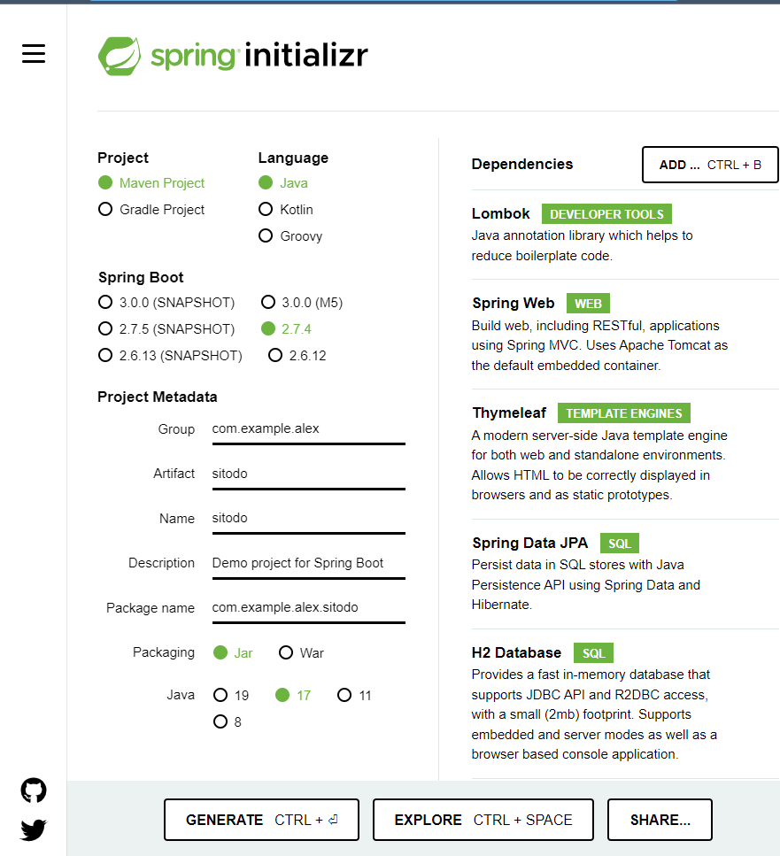
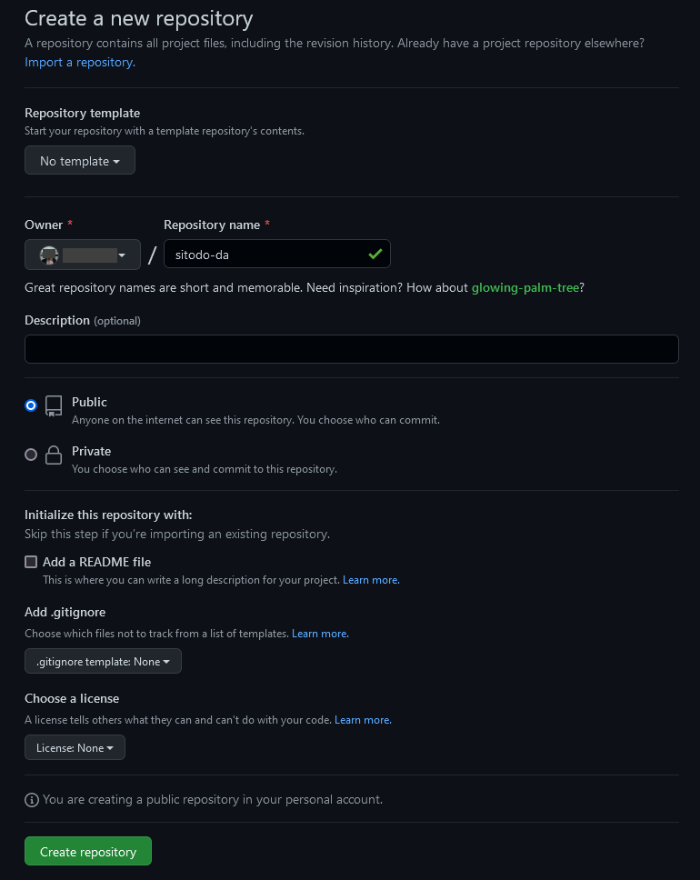

# Project Initialisation

Go to [Spring Initializr](https://start.spring.io/).

## Initialise a Spring Boot Project

Choose the following options:

-  Maven project
-  Java language
-  Spring Boot version 2.7.4 (the latest stable version at the time of writing)

1. Write the name of the base Java package in the **group** field.
   The name should follow the reverse-order domain naming scheme.
   Usually, the name is based on the actual domain name of a company.
   For example, if you work on a company called Example and the domain name is [`example.com`](#),
   then the _reverse-order_ name is `com.example`.
2. Write the name of the application in the **artifact** and **name** fields.
   Make sure the name starts with an alphabet symbol and does not contain a hyphen (e.g. `-`).
3. Provide a short description of the project in the **description** field.
4. **Package name** field should not be modified since it is generated from the values set in _group_ and _artifact_ fields.
   For example, if the _group_ is set to `com.example` and _artifact_ is set to `sitodo`,
   then the generated name will be `com.example.sitodo`.
5. Choose Java version **17** because it is the LTS (long-term support) version at the time of writing.

Include the following dependencies as well:

-  Lombok
-  Spring Web
-  Thymeleaf
-  Spring Data JPA
-  H2 Database

The final options should be similar to the following screenshot:



Generate and download the base code as a ZIP file by clicking the Generate button.
Extract the downloaded ZIP file into a directory of your choice.
For example, if you extract the ZIP file into the **home directory** of your operating system (OS),
there would be a new directory containing the source code at the following path:

-  GNU/Linux-based OS (e.g. Debian, Ubuntu): `/home/MyAccount/sitodo`
-  Windows: `C:\Users\MyAccount\sitodo`

Open a (terminal) shell in your OS and go to the project directory:

```shell
cd <path to the project directory>
```

Use provided Maven wrapper (`mvnw`) in the project directory to build the project using `package` command:

```shell
./mvnw package
```

If everything goes well, you will see a new directory named `output` that contains a JAR file.
Since we have verified that the project can be built successfully,
clean up the build artifacts using `mvnw clean` command:

```shell
./mvnw clean
```

## Initialise a Local Git Repository

Initialise the current working directory where the project was extracted as a new Git repository:

```shell
git init -b main .
```

Configure the local repository to use your credentials on GitHub:

```shell
git config user.name "<Full Name>"
git config user.email "<Email Address>"
```

Add all files into Git and save it as a new commit:

```shell
git add .
git commit
```

## Create an Online Git Repository on GitHub

Go to GitHub and create a new repository.
You can name it anything, but try to make it descriptive.
For the purpose of the bootcamp, name your new repository as `sitodo-INITIAL` where `INITIAL` is your abbreviated name.
Then, uncheck the option to create a README file, add no `.gitignore` file, and do not add any license for now:



Once you created the new repository, take note of its clone URL on GitHub.
Pick the HTTPS clone URL if you are new to Git and GitHub.
Then, go back to your shell and add a new _remote_ called `origin` using `git` command:

```shell
git remote add origin <URL to the remote repository>
```

Then push the commit from the `main` branch (i.e. the default branch in your local Git repository) to GitHub:

```shell
git push origin main
```

Open GitHub page of your repository and see if the source code has been pushed successfully.
Now let us move on to the next part of the course, which is to get introduced with test-driven development.
