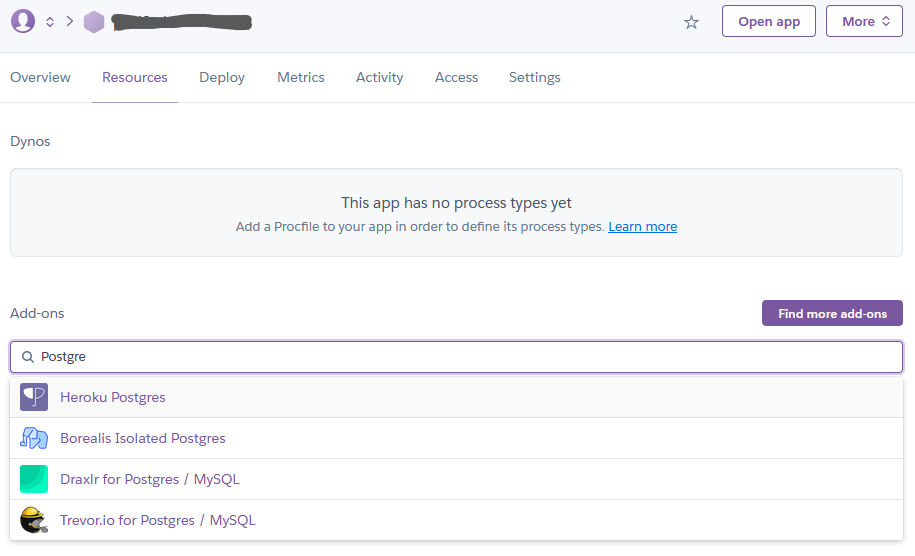

# Database Migration

Each time you run the app locally, a new test database is created in-memory.
The database only lives when the program is running.
When you shut down the app, the database is cleared from the memory as well.
While this makes it easy during tutorial, a real software deployment usually uses an actual database that persists the data in a storage medium.

A Web application is usually connected to a database engine such as MySQL or PostgreSQL on the production environment.
Obviously, we cannot always re-instantiate the database each time we perform deployment.
There might be some actual customer data present in the database.
Thus, it might cause grief, both for your company and the customer,
if the data were deleted after your application re-created the database from scratch on the production environment.

To help solve this problem, some frameworks support database migration tool.
We can define a series of migration scripts to keep the database updated with the latest changes in the code.
For example, we can ensure the table schema on the database is kept synchronized with the data models written in Java.
If there is a change in the data model, the migration scripts can define operations to update the database schema.
In addition, the migration scripts can also be used to populate the database with static data (such as a default admin user, reference tables, etc.).

## Setting Up Liquibase

Spring Boot provides support to two database migration tools: [Liquibase][] and [Flyway][].
In this tutorial, we will use Liquibase.

First, create a new Git branch named `feature/database-migration`:

```shell
git checkout -b feature/database-migration
```

Add a new dependency into `pom.xml`:

```xml
<dependency>
    <groupId>org.liquibase</groupId>
    <artifactId>liquibase-core</artifactId>
</dependency>
```

Afterward, create a new directory named `db` in `resources` directory of your production code
and create another directory named `changelog` inside the new `db` directory:

```shell
# (Mac OS/Linux/bash) the shell command equivalent to the instruction above
mkdir -p ./src/main/resources/db/changelog
```

Add a new YAML file named `db.changelog-master.yaml` in `changelog` directory:

> Note: Make sure you named the file correctly!
> By default, Spring Boot expects a Liquibase master migration script named `db.changelog-master.yaml`.

```yml
---
databaseChangeLog:
  - changeSet:
      id: 1
      author: sitodo_maintainer
      changes:
        - createSequence:
            sequenceName: hibernate_sequence
            dataType: INTEGER
            incrementBy: 1
            startValue: 1
            minValue: 1

        - createTable:
            tableName: todo_item
            columns:
              - column:
                  name: id
                  # Approximate the appropriate data type using existing types
                  # from java.sql package: https://docs.oracle.com/en/java/javase/17/docs/api/java.sql/java/sql/Types.html
                  type: INTEGER
                  autoIncrement: true
                  valueSequenceNext: hibernate_sequence
                  constraints:
                    primaryKey: true
                    primaryKeyName: pk_todo_item
              - column:
                  name: title
                  type: VARCHAR
                  constraints:
                    nullable: false
              - column:
                  name: finished
                  type: BOOLEAN
                  defaultValueBoolean: false
        - createTable:
            tableName: todo_list
            columns:
              - column:
                  name: id
                  type: INTEGER
                  autoIncrement: true
                  valueSequenceNext: hibernate_sequence
                  constraints:
                    primaryKey: true
                    primaryKeyName: pk_todo_list
        - createTable:
            tableName: todo_list_items
            columns:
              - column:
                  name: todo_list_id
                  type: INTEGER
                  constraints:
                    foreignKeyName: fk_todo_list_items_todo_list
                    referencedTableName: todo_list
                    referencedColumnNames: id
              - column:
                  name: items_id
                  type: INTEGER
                  constraints:
                    foreignKeyName: fk_todo_list_items_todo_item
                    referencedTableName: todo_item
                    referencedColumnNames: id
      rollback:
        - dropTable:
            tableName: todo_list_items
        - dropTable:
            tableName: todo_list
        - dropTable:
            tableName: todo_item

```

Some database migration tools promote their tools as database version control.
You can think Liquibase migration scripts similar to Git commits.
Each script may contain one or more **changeset** that will perform database-related operations.

For example, the first changeset in the migration script above will do the following:

1. Create a sequence in the database to keep track the auto-generated ID
2. Create every table defined in `model` package
3. Create a **join table** to handle one-to-many relationships between `TodoList` and `TodoItem`

The migration script also contains a rollback procedure that can be executed if you choose to do so via Maven command or Liquibase's CLI tool.
An example of executing a rollback script can be found at [Liquibase documentation](https://docs.liquibase.com/tools-integrations/springboot/using-springboot-with-maven.html).

## Configure In-Memory Database

Add a configuration property into `application.properties` in `src/main/resources` directory:

```properties
spring.datasource.url=jdbc:h2:mem:sitodo
```

The configuration above will tell Spring Boot application to use an H2 in-memory database named `sitodo`.
If you want to actually store the data into a file named `sitodo.db`, change the `spring.datasource.url` value into:

```properties
spring.datasource.url=jdbc:h2:file:./sitodo
```

> Reminder: Do not forget to ignore the database files (i.e. `sitodo.db, sitodo.mv.db`) from being tracked by Git.
> Update `.gitignore` and add these lines at the end of `.gitignore`:
> 
> -  `sitodo.db*`
> -  `sitodo.*.db`

Spring Boot also provides a console to access the H2 database when the application is running.
To enable the console, add `spring.h2.console.enabled=true` into `application.properties`.
The console can be accessed at `http://localhost:8080/h2-console`.

## Execute Migration Script

In this tutorial, Liquibase migration scripts are executed automatically when the application is run.
Try running the application and open the H2 database console to see the contents of the database.
You will see a glimpse of how a database migration tool tracks changes to the database.
They created a `CHANGELOG` table in the database to keep information related to the changes in the database.

## Use PostgreSQL Database on Heroku

Open Heroku dashboard and go to your app to check if your app has a Heroku Postgres.
If your app on Heroku does not have Heroku Postgres included in the add-ons,
you can install it from **Resources** tab.
In **Resources** page, type `Postgres` into **Add-ons** text input field.
Heroku will suggest several resources.
Among them is Heroku Postgres, as depicted in the following screenshot:



Click **Heroku Postgres** from the suggested add-ons.
Then, choose **Hobby Dev - Free** plan and click **Submit Order Form** button.
Heroku will create an instance of PostgreSQL and attach it to your application on Heroku.

According to [Heroku documentation](https://devcenter.heroku.com/articles/deploying-spring-boot-apps-to-heroku),
Heroku will initialise several environment variables such as `SPRING_DATASOURCE_URL`, `SPRING_DATASOURCE_USERNAME`,
and `SPRING_DATASOURCE_PASSWORD` that will override the configuration included in the app.
The application should automatically switch to PostgreSQL when re-deployed to Heroku.
The existing migration script will also initialise the database schema and sample data (if any) into the database.

## Create a New Changeset

Now let us try making new changeset to demonstrate how a migration script changes a database.
But first, make sure you have re-deployed your app to Heroku and make some sample todo items.

Edit `TodoItem` class in `model` package by adding a new instance variable named `priority` with the type of `Integer`:

```java
// TodoItem.java
import lombok.Data;
import lombok.NoArgsConstructor;

import javax.persistence.*;

@Data
@Entity
@NoArgsConstructor
public class TodoItem {
    // Existing attributes omitted for brevity

    @Column
    private Integer priority = 0; // Valid values: [0, 1, 2]
}
```

The new attribute will be used to describe the priority of a todo item.
Since this is a new attribute that does not exist yet in the database,
you need to create a changeset that will update the corresponding table with a new attribute.

Open Liquibase master migration script (i.e. `db.changelog-master.yaml`) and write the new changeset:

> Note: Be careful when modifying `.yml`/`.yaml` files, especially regarding indentation.
> Make sure the level of indentation is correct for every entry.

```yml
---
databaseChangeLog:
    - changeSet:
          id: 1
          author: sitodo_maintainer
          changes:
              - # Omitted for brevity
    - changeSet:
          id: 2
          author: your_name
          changes:
              - addColumn:
                    tableName: todo_item
                    columns:
                        - column:
                              name: priority
                              type: INTEGER
                              defaultValueNumeric: 0
          rollback:
              - dropColumn:
                    tableName: todo_item
                    columns:
                        - column:
                              name: priority
```

If you use a local, file-based H2 database, try testing the migration script by running the application locally.
Then, open H2 console to inspect the database.
Verify that the corresponding table for `TodoItem` object has a new attribute named `priority`.
All existing rows should also have new attribute with default value set to `0`.

If data migration has been successfully confirmed in the local database, save your work into a new Git commit.
Then, push the feature branch (i.e. `feature/database-migration`) to GitHub:

```shell
git add src/main/java/
git add src/main/resources/
git commit
git push origin feature/database-migration
```

Make sure the tests still pass and make a new Pull Request to merge the feature branch into the main branch.

[Liquibase]: https://www.liquibase.org/
[Flyway]: https://flywaydb.org/

## Challenge: Make Priority Attribute Usable by Users

Implement a new feature that lets users do the following:

-  See the priority on each todo item
-  Assign a priority value when they create a new todo item

Start implementing the feature by creating a new branch:

```shell
git checkout -b feature/create-read-priority
```

Work in the new branch. You may need to modify the following files:

-  `list.html` : Add a new column in the table for showing the priority value,
   and add another input text field to contain the priority value for a new todo item
-  `TodoListController.java` and `TodoListControllerTest.java` : Update the method that
   handles HTTP POST submission containing the new todo item, and also update the method
   that returns the list view

Once you are done, save your work as commit and push it to GitHub:

```shell
git add <path to modified/new files>
git commit
git push origin feature/create-read-priority
```

Make sure the tests still pass and make a new Pull Request to merge the feature branch into the main branch.
