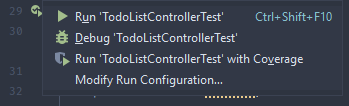
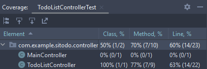
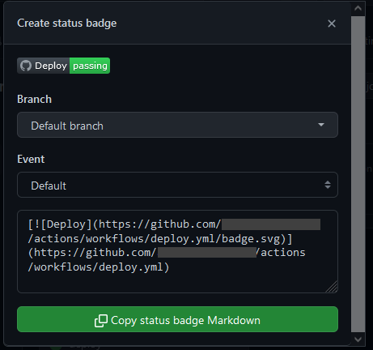

# Test Automation using GitHub Actions

Create a new YML file called `ci.yml` in `.github/workflows` directory of your project.
The file contains a new workflow that shall be executed on every commit that pushed to the repository
and on every pull request (PR) created on GitHub.

The content of `ci.yml` is as follows:

```yml
---
name: Continuous Integration (CI)

on: [ push, pull_request ]

jobs:
    test:
        name: Run all tests

        runs-on: ubuntu-22.04

        env:
            # Based on the Maven CI/CD template from GitLab:
            # https://gitlab.com/gitlab-org/gitlab/-/blob/master/lib/gitlab/ci/templates/Maven.gitlab-ci.yml
            # It is recommended to use these variables to reduce noise in the logs
            MAVEN_OPTS: >
                -Dhttps.protocols=TLSv1.2
                -Dorg.slf4j.simpleLogger.log.org.apache.maven.cli.transfer.Slf4jMavenTransferListener=WARN
                -Dorg.slf4j.simpleLogger.showDateTime=true
                -Djava.awt.headless=true
            MAVEN_CLI_OPTS: >
                --batch-mode
                --errors
                --fail-at-end
                --show-version
                -DinstallAtEnd=true
                -DdeployAtEnd=true

        steps:
            -   name: Checkout repository
                uses: actions/checkout@v3
            -   name: Set up Java
                uses: actions/setup-java@v3
                with:
                    distribution: "temurin"
                    java-version: "17"
                    cache: "maven"
            -   name: Run unit tests
                run: mvn $MAVEN_CLI_OPTS test
```

Save the file as a new Git commit and push it to GitHub:

```shell
git add .github/workflows/ci.yml
git commit
git push origin main
```

Open the Actions tab on your GitHub repository page.
You will see two workflows running in parallel: `deploy` and `ci`.
Wait for a moment until both workflows finishes.
Ensure that both workflows end successfully.

It is possible for `ci` workflow to fail.
If the test cases execution contains a failing test result,
then `ci` workflow will report that as a failure in workflow execution.
If that is the case with your current code, try to fix your code to make the `ci` pass.
But do not spuriously fix it by rapidly pushing new commit only to see if the `ci` works.
Run the test cases locally using IDE or Maven `mvnw test` before pushing the latest changes to GitHub.

## Measure Code/Line Coverage

We can measure how extensive a production code is tested by measuring the line coverage.
It is a metric that expresses the ratio of tested code compared to all lines on code (LOC).

Suppose you have a source code of an application that contains 1000 LOC.
If the line coverage reported 75% coverage, it means only 750 out of 1000 LOC that have been executed during testing.
The remaining 250 LOC are not yet executed.
Based on that fact, you can estimate that 250 LOC are not yet tested (or, "covered") by the test cases.

If you are using IntelliJ, you can execute tests with coverage via the shortcuts.
You can selectively run a test case or a test suite by opening it in the editor,
click the green "Play" button to show the possible shortcuts
and choose "Run 'Test' with Coverage", as depicted in the following screenshot:



After the test finished, you can see the coverage report in IDE:



In this exercise, you will configure Maven to use a plugin called JaCoCo to generate the code coverage report.
First, add a new plugin called `jacoco-maven-plugin` into `pom.xml`, specifically in the `<build>` section:

```xml

<build>
    <plugins>
        <plugin>
            <groupId>org.springframework.boot</groupId>
            <artifactId>spring-boot-maven-plugin</artifactId>
            <configuration>
                <excludes>
                    <exclude>
                        <groupId>org.projectlombok</groupId>
                        <artifactId>lombok</artifactId>
                    </exclude>
                </excludes>
            </configuration>
        </plugin>
        <plugin>
            <groupId>org.jacoco</groupId>
            <artifactId>jacoco-maven-plugin</artifactId>
            <version>0.8.8</version>
        </plugin>
    </plugins>
</build>
```

Configure the plugin according to an example modified from [Baeldung][]:

```xml

<plugin>
    <groupId>org.jacoco</groupId>
    <artifactId>jacoco-maven-plugin</artifactId>
    <version>0.8.8</version>
    <executions>
        <execution>
            <id>jacoco-initialize</id>
            <goals>
                <goal>prepare-agent</goal>
            </goals>
        </execution>
        <execution>
            <id>jacoco-site</id>
            <phase>test</phase>
            <goals>
                <goal>report</goal>
            </goals>
        </execution>
    </executions>
</plugin>
```

Run the test cases using `mvnw test` Maven command.
The code coverage will be measured during testing.
At the end of testing, JaCoco will generate a code coverage report.
You can find the report in `build` directory.
The report, by default, is written in HTML, so you can view it in your browser.

## Status Badges

If you check some open-source projects on GitHub,
you might have seen some repositories displayed badges in their README.
By looking at the badges, you can quickly know some status from the project.

You can also do the same with your projects.
Some badges are pretty straightforward to set up.
For example, you can create a badge that displays the status of a workflow in GitHub Actions.

Suppose you want to show the deployment status of your project.
Open Actions page on your GitHub repository and click "Deploy" workflow.
Click "..." button at the end of the filter input field on the page and choose "Create status badge":



Choose default options for branch and event.
Then, copy the generated status badge Markdown and put it into your project's `README.md` file.
Save your `README.md` file as a commit and push it to GitHub.
You will see that if you open your project page on GitHub, the README will display the badge.

## Coverage Badge

There are also some badges that require some configuration, such as badges to display a code coverage report.
You can use [`jacoco-badge-generator`](https://github.com/cicirello/jacoco-badge-generator) as a GitHub action in your `ci.yml` workflow.
The project already provided an example in their README file,
so read the documentation and try to use it in your own project!

[Baeldung]: https://www.baeldung.com/sonarqube-jacoco-code-coverage#3-dependencies-and-plugins-for-jacoco):
